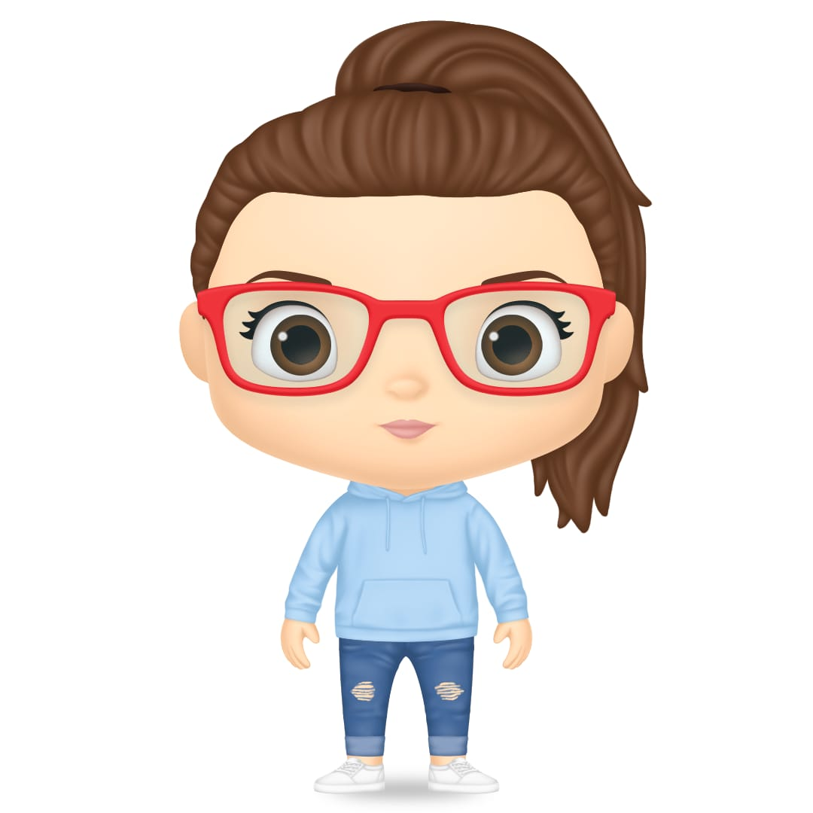

 
<h1 align="center">Hi! 👋 I'm Astrid </h1>
<h3 align="center">A versatile Girl... ! </h3>
 

<h3 align="center">✨ I'm curious, hungry and always learning!✨ </h3>

Currently, I'm learning about UX|UI & Data Science with Phyton & R 💗 

Let me introduce myself... 

- 💻 I'm a Project Leader in technology projects with +10 years of experience leading teams and projects
- 👩🏻‍🎓 Chemical Engineer
- 👩🏻‍🎓 Master degree in Control Engineering and Process Automation
- 💻 I studied Full Stack Developer (javascript & JAVA) but I'm not fan 🤣
- 🍕 I'm a Pizza lover!
- 🌱 I’m currently learning everything 
- 💡 Idea is my Favorite word!
- 
- 📫 How to reach me **astrid.amg@gmail.com**

- 👨‍💻 You can also check out my linkedin at [astrid](https://www.linkedin.com/in/astrid-medina/)

<h3 align="left"> ⚡ Connect with me </h3>

  
 

<h3 align="left"> 🛠️ Code language and tools:</h3> 

<!-- -->

 
 

&nbsp;

 
<!--

&nbsp;
 -->

<h3 align="center">ALL IS WELL! 🙌</h3>
 

 <h3 align="center"> 🔥 Last Project: Under Construction </h3>

