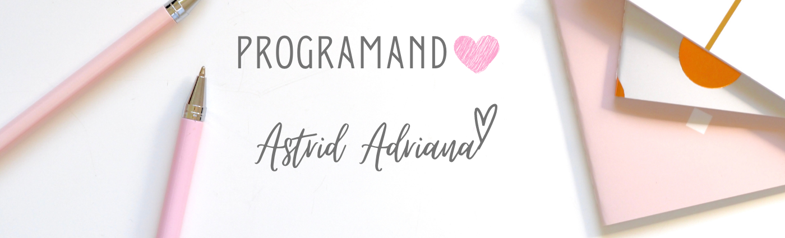

 
<h1 align="center">Hi 👋, I'm Astrid </h1>
<h3 align="center">A Girl trying to Figure-Out Stuff!! </h3>
 

✨ I love create new things, teach and help people to growing up! ✨ 

Currenttly, 

I'm a studying and learning about **Full Stack Developer** and I like so much!💗

but, let me introduce myself... 

- 👩🏻‍🎓 I'm a Process Engineer and I have a master degree in Control Engineering and Process Automation
- 🚀 I'm a skydiver girl
- 🍕 I'm a Pizza lover!
- 🌱 I’m currently learning everything 🤣
- 👯 I’m looking to collaborate with other content creators
- 💡 Idea is my Favorite word!
- ⚡ Fun fact: I love to fly and **I think I am funny xD**
- 🔭 I just launched my first blog article: [Become A Code SuperHero!][link]!
- 📫 How to reach me **astrid.amg@gmail.com**
- 👨‍💻 You can also check out my portfolio at [astrid](https://Sifrisky.github.io/astrid/)

<h3 align="left"> ⚡ Connect with me </h3>

 

<h3 align="left"> 🛠️ Code language and tools:</h3> 

 

 
 

&nbsp;

 
<!--

&nbsp;
 -->

<h3 align="center">I hope we can meet and work together! 🙌</h3>
 

 <h3 align="center"> 🔥 Last Project: http://astridtoys.herokuapp.com/ </h3>

